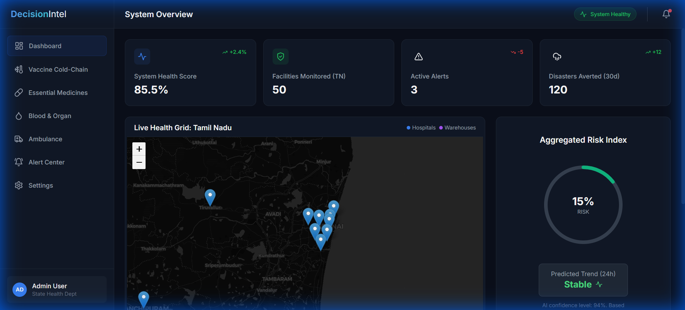
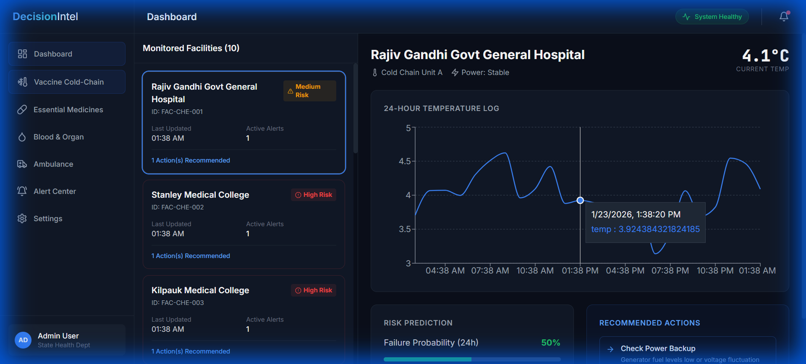

# MedUnion 🏥

**The missing AI layer for public health.**

> "A unified AI layer connecting hospitals & cold chains. Predicts vaccine/drug spoilage, blood/organ delays & ambulance gaps before they cost lives."



## 🚀 The Problem
Public health infrastructure operates in silos.
- **Vaccine Cold Chains** don't talk to **Hospitals**.
- **Blood Banks** are disconnected from **Surgical Demand**.
- **Medicine Warehouses** lack real-time visibility into **Hospital Consumption**.

This fragmentation leads to **preventable loss of life** due to stockouts, spoilage, and logistic delays.

## 💡 The Solution: MedUnion
MedUnion is a **Unified Healthcare Interface (UHI)** that acts as a central intelligence layer for state health departments. It integrates fragmented data streams into a single, proactive decision-making grid.

### Key Modules
1.  **Vaccine Cold-Chain ❄️**
    *   Real-time IoT monitoring of freezer temperatures.
    *   AI prediction of spoilage risk (Red/Amber/Green).
    *   *Impact:* Prevents wastage of high-value vaccines.

2.  **Essential Medicines 💊**
    *   Predictive inventory management for critical drugs.
    *   Automated redistribution logic (moving stock from surplus to deficit centers).
    *   *Impact:* Zero "stock-out" events for life-saving drugs.

3.  **Blood & Organ 🩸**
    *   Live tracking of time-sensitive biological need.
    *   *Impact:* Faster delivery of organs for transplant.

4.  **Ambulance Readiness 🚑**
    *   Predictive fleet positioning based on historical accident data.
    *   Real-time coverage gap analysis.
    *   *Impact:* Reduced response times during golden hour.

## 📸 Screenshots

### Live Health Grid (Tamil Nadu Example)
Real-time monitoring of critical nodes.


### Vaccine Cold-Chain Monitoring
Detailed drill-down into specific freezer units and temperature logs.


## 🛠️ Tech Stack
- **Frontend:** React 19, Vite, TailwindCSS, Leaflet Maps
- **Backend:** Python FastAPI, AI/ML Intelligence Engine
- **Data:** Synthetic generators modeled on real Tamil Nadu health infrastructure (TNMSC, 108 GVK EMRI).

## 🏃‍♂️ Getting Started

### Prerequisites
- Node.js 18+
- Python 3.10+

### Installation
1. **Clone the repo**
   ```bash
   git clone https://github.com/yourusername/med-union.git
   cd med-union
   ```

2. **Start Backend**
   ```bash
   cd backend
   pip install -r requirements.txt
   python -m uvicorn main:app --reload
   ```

3. **Start Frontend**
   ```bash
   # Open a new terminal
   npm install
   npm run dev
   ```

4. **Access the Grid**
   Open `http://localhost:5173` and login with Demo Mode (National Admin).

---
*Built for the Future of Public Health.*
